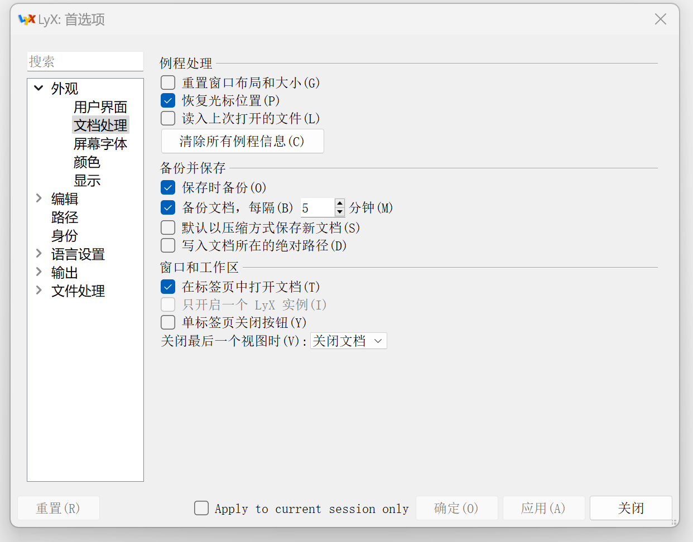
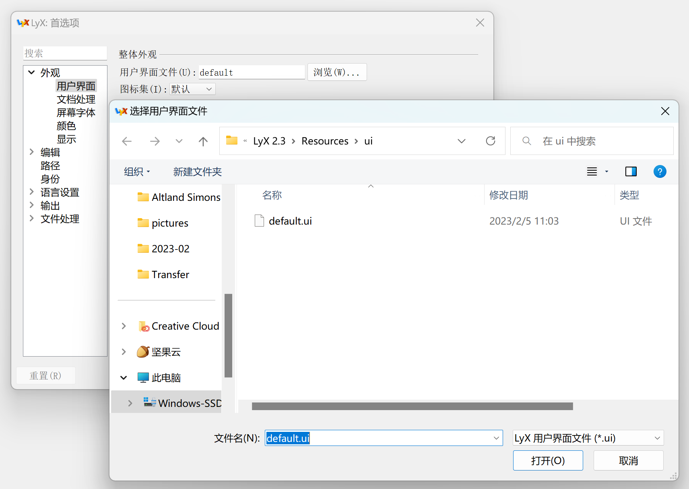
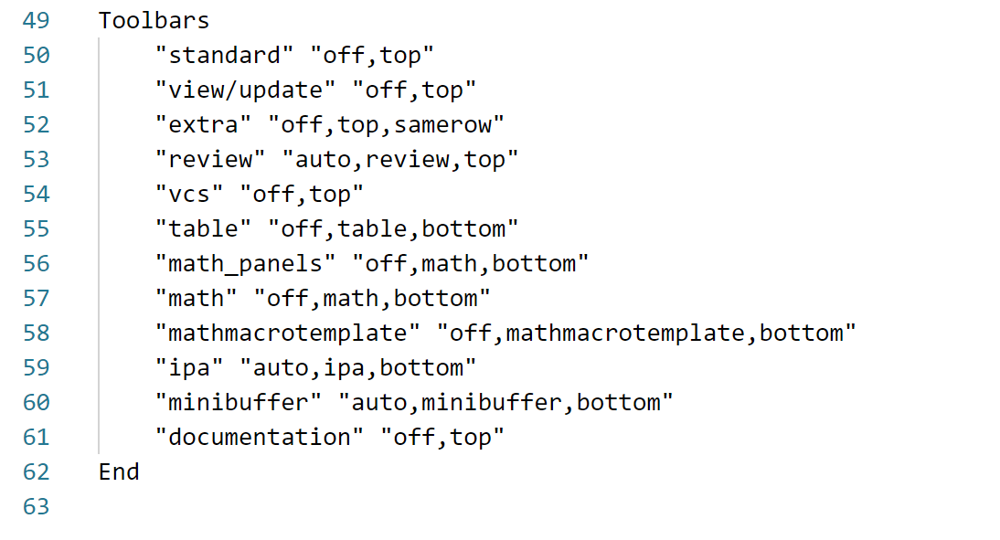
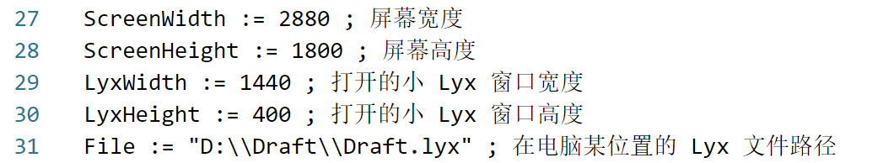

## Obsidian 内使用 Lyx

本脚本为在 Obsidian 内使用 Lyx 输入公式的插件。

<video src="./../videos/2023-02-05-22-31-41.mp4"></video>

### Lyx文件

新建一个Lyx文件，放在某个地方即可

### Lyx中的设置

为了让弹出框的过程比较顺滑，需要做以下操作。

Lyx->工具->首选项->外观->文档处理->重置窗口布局和大小关闭。

这样会导致打开的窗口是默认设置，窗口不够简洁，为了窗口更简洁我们可以修改：

Lyx->工具->首选项->外观->用户界面->用户界面文件->浏览

之后右键打开该文件编辑即可：

为了简洁可以把on全部改为off，也可以保留部分auto，记住了快捷键之后这些栏其实都没有什么用。

### 脚本中需要修改的地方

高度和宽度是以像素为单位的，屏幕高度和宽度只需去设置中查看，Lyx窗口的高度和宽度需要自己设置，使用一个看着舒服的值就好。

File即为建立的Lyx文件的路径。

此外还需要修改这里，把前面的部分替换为使用的实际路径就好。
